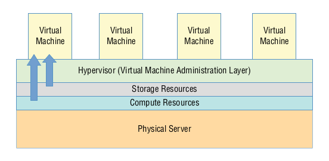
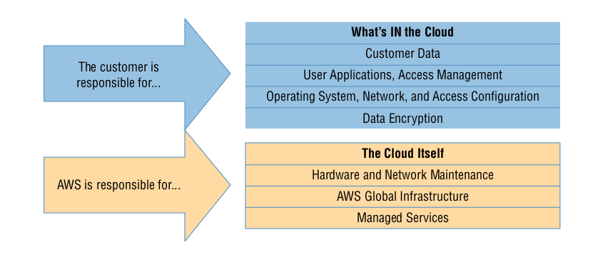

# Introduction to Cloud Computing and AWS

## Cloud Computing and Virtualisation

- The technology that lies at the core of all cloud operations is virtualisation - which allows you to divide the hardware resources of a single physical server into smaller units.
- That physical server could therefore host multiple virtual machines (VMs) running their own complete operating systems, each with its own memory, storage, and network access.

### Cloud Computing Architecture

- A cloud computing platform offers on-demand, self-service access to pooled compute resources where your usage is metered and billed according to the volume you consume.

- Cloud computing systems allow for precise billing models, sometimes involving fractions of a penny for an hour of consumption
- The cloud is a great choice for so many serious workloads because it’s scalable, elastic, and, often, a lot cheaper than traditional alternatives.
  - **Scability** - A scalable infrastructure can efficiently meet unexpected increases in demand for your application by automatically adding resources - such as as increasing the number of instances.
  - **Elasticity** - A scalable environment lets you ramp up capacity to meet rising demand, whereas an elastic infrastructure will automatically reduce capacity when demand drops. This makes it possible to control costs, since you’ll run resources only when they’re needed.
  - **Cost Management** - Cloud computing transitions your IT spending from capex to opex which allows you to not have to worry about up-fronts costs for every new server you deploy. AWS provides a Total Cost of Ownership (TCO) Calculator to help you understand the full implications of cloud compute spending.

## The AWS Cloud

Keeping up with the steady stream of new services showing up on the AWS Console can be frustrating. But as a solutions  architect, your main focus should be on the core service categories.

| Category                | Service                              | Function                                                     |
| ----------------------- | ------------------------------------ | ------------------------------------------------------------ |
| Compute                 | Elastic Compute Cloud (EC2)          | EC2 server instances provide virtual versions of the servers you would run in your local data centre. |
|                         | Lambda                               | Allows for the execution of code without providing a server  |
|                         | Auto Scaling                         | Copies of running EC2 instances can be defined as image templates and automatically scaled up or down depending upon demand |
|                         | Elastic Load Balancing               | Incoming network traffic can be directed between multiple web servers to ensure that a single web server isn’t overwhelmed while other servers are underused or that traffic isn’t directed to failed servers. |
|                         | Elastic Beanstalk                    | Beanstalk is a managed service that abstracts the provisioning of AWS compute and networking infrastructure. You are required to do nothing more than push your application code. |
| Networking              | Virtual Private Cloud (VPC)          | VPCs are highly configurable networking environments designed to host your EC2 (and RDS) instances. VPCs can be used to control inbound and outbound network access. |
|                         | Direct Connect                       | You can use Direct Connect to establish an enhanced direct tunnel between your local data centre or office and your AWS-based VPCs |
|                         | Route 53                             | Route 53 is the AWS DNS service that lets you manage domain registration, record administration, routing protocols, and health checks, which are all fully integrated with the rest of your AWS resources |
|                         | CloudFront                           | CloudFront is Amazon’s distributed global content delivery network (CDN) |
| Storage                 | Simple Storage Service (S3)          | S3 offers highly versatile, reliable, and inexpensive object storage that’s great for data storage and backups |
|                         | S3 Glacier                           | A good choice for when you need large data archives stored cheaply over the long term and can live with retrieval delays measuring in the hours. |
|                         | Elastic Block Store (EBS)            | EBS provides the persistent virtual storage drives that host the operating systems and working data of an EC2 instance. |
|                         | Storage Gateway                      | Storage Gateway is a hybrid storage system that exposes AWS cloud storage as a local, on-premises appliance. |
| Database                | Relation Database Service (RDS)      | RDS is a managed service that builds you a stable, secure, and reliable database instance. |
|                         | DynamoDB                             | DynamoDB can be used for fast, flexible, highly scalable, and managed nonrelational (NoSQL) database workloads. |
| Application Management  | CloudWatch                           | CloudWatch can be set to monitor process performance and resource utilisation and, when preset thresholds are met, either send you a message or trigger an automated response. |
|                         | CloudFormation                       | This service enables you to use template files to define full and complex AWS deployments. |
|                         | CloudTrail                           | CloudTrail collects records of all your account’s API events. This history is useful for account auditing and troubleshooting purposes. |
|                         | Config                               | The Config service is designed to help you with change management and compliance for your AWS account. |
| Security and Identity   | Identity and Access Management (IAM) | You use IAM to administrate user and programmatic access and authentication to your AWS account. |
|                         | Key Management Service (KMS)         | KMS is a managed service that allows you to administrate the creation and use of encryption keys to secure data used by and for any of your AWS resources. |
|                         | Directory Service                    | For AWS environments that need to manage identities and relationships, Directory Service can integrate AWS resources with identity providers like Amazon Cognito and Microsoft AD domains. |
| Application Integration | Simple Notification Service (SNS)    | SNS is a notification tool that can automate the publishing of alert topics to other services such as lambda. |
|                         | Simple Workflow (SWF)                | SWF lets you coordinate a series of tasks that must be performed using a range of AWS services or by human intervention |
|                         | Simple Queue Service (SQS)           | SQS allows for event-driven messaging within distributed systems that can decouple while coordinating the discrete steps of a larger process. |
|                         | API Gateway                          | This service enables you to create and manage secure and reliable APIs for your AWS-based applications. |

## AWS Platform Architecture

- AWS maintains data centres for its physical servers around the world. 
- As the centres are so widely distributed, you can reduce your own services’ network transfer latency by hosting your workloads geographically close to your users. 
- It can also help you manage compliance with regulations requiring you to keep data within a particular legal
  jurisdiction.
- Example regions include US East (Ohio) `us-east-2.amazonaws.com`  and EU (London) `eu-est-2.amazonaws.com`.

- Some AWS services are offered from edge network locations, such as Amazon CloudFront, Amazon Route 53, AWS Firewall Manager, AWS Shield, and AWS WAF.

- You organise your resources from a region within one or more virtual private clouds (VPCs). A VPC is effectively a network address space within which you can create network subnets and associate them with availability zones. When configured properly, this architecture can provide effective resource isolation and durable replication.

## AWS Reliability and Compliance

- AWS has invested significant planning and funds into resources and expertise relating to infrastructure administration. Its heavily protected and secretive data centres, layers of redundancy, and carefully developed best-practice protocols would be difficult or even impossible for a regular enterprise to replicate.

- Where applicable, resources on the AWS platform are compliant with dozens of national and international standards, frameworks, and certifications, the details of which can be found here: `https://aws.amazon.com/compliance/programs`

### The Shared Responsibility Model

- Amazon distinguishes between the security and reliability of the cloud, which is *its responsibility*, and the security and reliability of what’s *in the cloud*, which is up to the end user.

- AWS is responsible for making sure that its locations are secure, reliably powered, and properly maintained, as well as patching, encrypting (where relevant), and maintaining the operating systems and virtualisation software running its physical servers and for the software running its managed services.
- AWS customers are responsible for whatever happens within that cloud. This covers the security and operation of installed operating systems, client-side data, the movement of data across networks, end-user authentication and access, and customer data.

### The AWS Service Level Agreement

- AWS doesn’t guarantee that there will be no service disruptions or security breaches - drives may stop spinning, major electricity systems may fail, and natural disasters may happen.

- But when something does go wrong, AWS will provide service credits to reimburse customers for their direct losses whenever uptimes fall below a defined threshold.
- The exact percentage of the guarantee will differ according to service, for example the SLA for AWS EC2 is 99.99 percent which means there can be up to four minutes of down time each month.

## Working with AWS

- The browser-based management console is an excellent way to introduce yourself to a service’s features and learn how it will perform in the real world. There are few AWS administration tasks that you can’t do from the console, which provides plenty of useful visualisations and helpful documentation.

- The AWS Command Line Interface (CLI) lets you run complex AWS operations from your local command line, for example you can launch half a dozen EC2 instances using one command
- If you want to incorporate access to your AWS resources into your application code, you’ll need to use an AWS software development kit (SDK) for the language you’re working with.

### Technical Support

- Sooner or later, you’ll need some kind of technical or account support. There’s a variety of types of support, and you should understand what’s available.
  - The **Basic plan** is free with every account and gives you access to customer service, along with documentation, white papers, and the support forum. Customer service covers billing and account support issues.
  - The **Developer plan** starts at $29/month and adds access for one account holder to a Cloud Support associate along with limited general guidance and "system impaired" response.
  - The **Business plan** starts at $100/month and will deliver faster guaranteed response times to unlimited users for help with “impaired” systems, personal guidance and trouble shooting, and a support API.
  - **Enterprise support** plans start at $15,000/month and cover all of the other features, plus direct access to AWS solutions architects for operational and design reviews, your own technical account manager, and something called a support concierge. For complex, mission-critical deployments, those benefits can make a big difference. 

- There’s plenty of self-serve support available outside of the official support plans:
  - AWS community help forums are open to anyone with a valid AWS account `forums.aws.amazon.com`
  - Extensive and well-maintained AWS documentation is available at `aws.amazon.com/documentation`
  - The AWS Well-Architected page is a hub that links to some valuable white papers and documentation addressing best practices for cloud deployment design `aws.amazon.com/architecture/well-architected`
  - There are also plenty of third-party companies offering commercial support for your AWS deployments.

