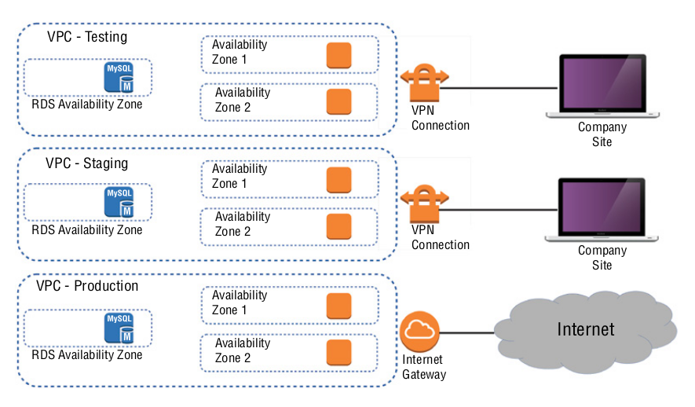
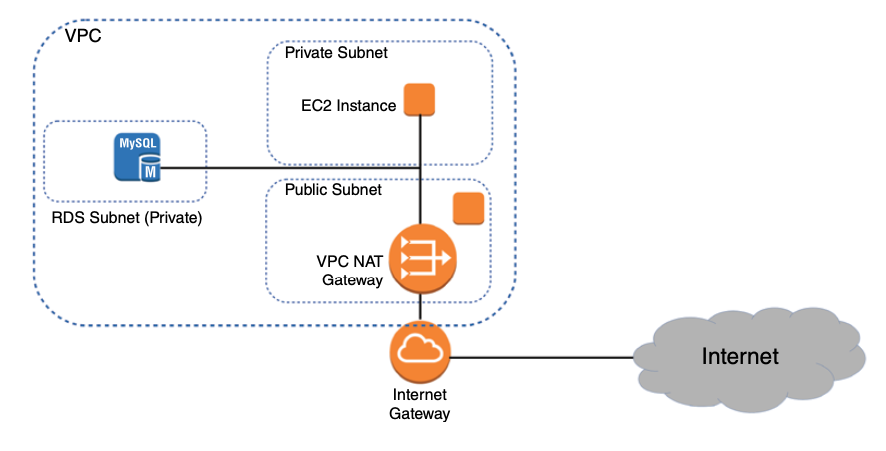

# Amazon Elastic Compute Cloud and Amazon Elastic Block Store

AWS’s Elastic Compute Cloud (EC2) is designed to replicate the data centre/server room experience as closely as possible. EachEC2 virtual server, is known as an *instance*.

## EC2 Instances

- An EC2 instance may only be a virtualized and abstracted subset of a physical server, but it behaves just like the real thing.
- You configure your instance’s operating system and software stack, CPU, memory, primary storage, and network performance, and environment before launching it. 
- The OS is defined by the Amazon Machine Image (AMI) you choose, and the hardware follows the instance type.
  - **Amazon Quick Start AMIs** - includes various releases of Linux or Windows Server OSs and some specialty images for performing common operations (like deep learning and database). These are up-to-date officially supported images.
  - **AWS Marketplace AMIs** - include official, production ready images provided and supported by industry vendors like SAP and Cisco.
  - **Community AMIs** - includes images that are created and maintained by independent vendors and are usually built to meet a specific need.
  - **Private AMIs** - includes images created from your own instance deployments as private AMIs.

***Note:** A particular AMI will be available in only a **single region** - although there will often be images with identical functionality in all regions.*

### Instance Types

- AWS allocates hardware resources to your instances according to the instance type that is selected.

- Should your needs change over time, you can easily move to a different instance type by stopping your instance, editing its instance type, and starting it back up again.organised
- There are currently more than 75 instance types organised into five instance families
  - **General Purpose** - A1, T3, T3a, T2, M6g, M5, M5a, M5n, M4 - aims to provide a balance of compute, memory, and network resources (t2.micro is part of the free tier).
  - **Compute optimised** - C5, C5n, C4 - provides more compute capacity for demanding web servers and high-end machine learning workloads as well as strong network bandwidth.
  - **Memory optimised** - R5, R5a, R5n, X1e, X1, High Memory, z1d - provide environments for intensive database, data analysis, and caching operations - the largest memory supported is 3.9TB of RAM and low-latency SSDs volumes can be attached.
  - **Accelerated computing** - P3, P2, Inf1, G4, G3, F1 - provides high-end computational capabilities for demanding workloads such as 3D visualizations and rendering, financial analysis, and computational fluid dynamics.
  - **Storage optimised** - I3, I3en, D2, H1 - provides large, low-latency instance storage volume that are designed to work with distributed filesystems and heavyweight data processing applications.
  
- ***Note:** T2s are burstable, which means you can accumulate CPU credits when your instance is under-utilised that can be applied during high-demand periods in the form of higher CPU performance.*

### Virtual Private Clouds (VPCs)

- Virtual private clouds (VPCs) are a way in which you can organise your infrastructure.
- Adding a simple VPC that doesn’t incorporate a network address translation (NAT) gateway or VPN access won’t cost you anything.

### Tenancy

- When launching an EC2 instance, you’ll have the opportunity to choose a tenancy model.
  - **Shared Tenancy** (default option) allows your virtual machine to run on a physical server that’s concurrently hosting other instances (such as other AWS Customers)
  - **Dedicated Instances** ensures that your instance will run on a dedicated physical server, meaning that it won't be sharing the server with other AWS accounts - this is often chosen to ensure any special regulatory requirements are met.
  - **Dedicated Host** allows you to actually identify and control the physical server you’ve been assigned to meet more restrictive licensing or regulatory requirements.

### Configuring Instance Behaviour

- You can optionally tell EC2 to execute commands on your instance as it boots by pointing to user data in your instance configuration (aka bootstrapping).
- For example, you could install a web server on the first boot of the instance

### Placement Groups

- By default AWS will attempt to spread your instances across their infrastructure to create a profile that will be optimal for most use cases.

- EC2 placement groups give you the power to define nonstandard profiles to better meet your needs.
  - **Cluster** - launches each associated instance into a single availability zone within close physical proximity to each other, allowing for low-latency networking inter-connectivity and can be useful for high-performance computing (HPC) applications.
  - **Spread** - launches instances physically across distinct hardware racks and even availability zones to reduce the risk of failure-related data or service loss. This can be useful when you’re running hosts that can’t tolerate multiple concurrent failures.
  - **Partition** - lets you associate some instances with each other, placing them in a single "partition", but the instances within that single partition can be kept physically separated from instances within other partitions. This differs from spread groups where no two instances will ever share physical hardware.

### Instance Pricing

You can purchase the use of EC2 instances through one of three models.

- **On-Demand Instances**
  - The most expensive pricing tier is on-demand, where you pay for every hour the instance is running, and is dependant upon the instance type and the region where it's running.
  - On-demand is great for workloads that need to run for a limited time without interruption, e.g. schedule an on-demand instance in anticipation of increased requests against your application.

 - **Reserved Instances**
   - If your application needs to run uninterrupted for more than a month at a time, then you’ll usually be better off purchasing a reserved instance, with one and three year terms being widely available.
   - When purchasing a reserved instance, you’re paying AWS (or other AWS customers who are selling reservations they are no longer using) for the *right* to run an EC2 instance at a specified cost during the reservation term.
   - Reserved instances are paid for using an *All Upfront*, *Partial Upfront*, or *No Upfront* payment option — the more you pay up front, the less it’ll cost you overall.

- **Spot Instances**
  - For workloads that don’t need to run constantly and can survive unexpected shutdowns, the cheapest option will usually  involve requesting instances on the EC2 spot market.
  - AWS makes unused compute capacity available at steep discounts — as much as 90% off the on-demand cost.
  - The catch is that the capacity can, on two minutes’ notice, be reclaimed by shutting down your instance.
  - Spot instances are not ideal when you require persistence and predictability, but can be great for certain classes of containerised big data workloads

It will often make sense to combine multiple models within a single application infrastructure. An online store might, for instance, purchase one or two reserve instances to cover its normal customer demand but also allow autoscaling to automatically launch on-demand instances during periods of unusually high demand.

### Instance Lifecycle

The state of a running EC2 instance can be managed in a number of ways.

- **Terminating** the instance will shut it down and cause its resources to be reallocated to the general AWS pool.
- If your instance won’t be needed for some time but you don’t want to terminate it, you can stopping it and then restarting it when it’s needed again. The data on an EBS volume will in this case not be lost, although that would not be true for an instance volume.

You should be aware that a stopped instance that had been using a non-persistent public IP address will most likely be assigned a different address when it’s restarted - allocate an elastic IP address to the instance if you require the IP to be the same across restarts.

### Resource Tags

- AWS resource tags can be used to label everything you’ll ever touch across your AWS account
- Tags have a key and, optionally, an associated value, for example key=environment, value=production
- Tags can improve the visibility of your resources, making it much easier to manage them effectively, audit and control costs and billing trends, and avoid costly errors.

### Service Limits

- Each AWS account has limits to the number of instances of a particular service you’re able to launch - for example, you’re allowed only five VPCs per region and 5,000 Secure Shell (SSH) key pairs across your account.
- Some Service Limits are "soft" limits, meaning that you can request AWS to increase them on your account, others are not (e.g. maximum CPU for a given EC2 instance)

## EC2 Storage Volumes

Storage volumes are virtualised spaces carved out of larger physical drives, but to the OS running on your instance, the volume will present themselves exactly as though they were normal physical drives. 

There are multiple types of volumes, with each one catering for different use cases.

### Elastic Block Store Volumes

- Instances can have multiple Elastic Block Store (EBS) volumes attached to them, although only one volume can be attached to no more than one instance at a time.
- AWS SLA for the reliability of the data stored on EBS volumes is 99.99% - if an EBS drive does fail, it's data has already been duplicated and will be brought back online before anyone notices a problem.
- There are EBS volume types, two using SSD technologies and two using the older spinning hard drives - the performance of each type is measured in maximum IOPS/volume
  - **EBS-Provisioned IOPS SSD (EBS Optimised)** — is designed for applications that require intense rates of I/O operations
    - **Volume Size:** 4GB - 16TB
    - **Max IOPS/volume:** 64,000
    - **Max Throughput/volume (MB/s):** 1,000
    - **Price (per month):** $0.125/GB
  - **EBS General-Purpose SSD** - is designed for most regular server workloads that require low-latency performance
    - **Volume Size:** 1GB - 16TB
    - **Max IOPS/volume:** 16,000
    - **Max Throughput/volume (MB/s):** 250
    - **Price (per month):** $0.10/GB
  - **Throughput-Optimised HHD** - is designed for applications that require high throughput-intensive workloads, such as log processing
    - **Volume Size:** 500GB - 16TB
    - **Max IOPS/volume:** 500
    - **Max Throughput/volume (MB/s):** 500
    - **Price (per month):** $0.045/GB
  - **Cold HHD** - is designed for storing large volumes of data that requires infrequent access
    - **Volume Size:** 500GB - 16TB
    - **Max IOPS/volume:** 250
    - **Max Throughput/volume (MB/s):** 250
    - **Price (per month):** $0.025/GB

### EBS Volume Features

- EBS volumes can be copied by creating a snapshot
- Snapshots can be used to create new volumes that can be shared and/or attached to other instances
- An AMI image can be generated from an existing running instance - although it's generally recommended to shutdown the instance first to ensure no data loss
- EBS volumes can be encrypted to protect that data while at rest, or as it's send back and forth to the EC2 host instance - EBS will handle the decrypting the data behind the scenes for you.

### Instance Store Volumes

- Instance store volumes are ephemeral - meaning that that when the instances they’re attached to are shut down, their data is permanently lost
- Instance store volumes are SSDs that are physically attached to the server that is hosting your instance, and thus provide fast read/write times.
- The price of an instance store volume is included in the price of the instance itself.

EBS volumes are likely to be the right choice for instances whose data needs to persist beyond a reboot, while Instance store volumes are useful for operations requiring low-latency access to large amounts of data that need not survive a system failure or reboot. 

## Accessing EC2 Instances

- EC2 instances are identified by unique IP addresses, and are assigned at least one private IPv4 address that, by default, will fall within one of the following blocks:
  - 10.0.0.0 - 10.255.255.255
  - 172.16.0.0 - 172.31.255.255
  - 192.168.0.0 - 192.168.255.255

- Out of the box, you’ll only be able to connect to your instance from within its subnet, and the instance will have no direct connection to the Internet.
- Instances also support attaching one or more virtual elastic network interfaces to all for connections to other network resources - each of which must be connected to an existing subset and security group.
- An instance can also be assigned a public IP through which full Internet access is possible.
- The default public IP assigned to your instance is ephemeral and will not survive a reboot - in order to allocate a permanent IP you need to use an elastic IP

## Securing EC2 Instances

AWS provides four tools to help you secure your EC2 instances: security groups, Identity and Access Management (IAM) roles, network address translation (NAT) instances, and key pairs.

### Security Groups

- EC2 security group plays the role of a firewall — by default, a security group will deny all incoming traffic while permitting all outgoing traffic

- You define security group behaviour by setting policy rules that will either block or allow specified traffic types — once setup all traffic is will be processed according to those rules
- Traffic is assessed by examining its source and destination, the network port it’s targeting, and the protocol it’s set to use. 
- Security group rules can be applied to multiple instances.

### Identity and Access Management (IAM) Roles

- You define an IAM role by giving it permissions to perform actions on specified services or resources within your AWS account. 

- When a particular role is assigned to a resource (such as EC2) or a user, they’ll gain access to whichever resources were included in the role policies.

- An IAM role can be assigned *to* an EC2 instance so that processes running within it can access the external tools — like an RDS database instance — it needs to do its work

### Network Address Translation (NAT) Devices

- Sometimes you’ll need to configure an EC2 instance without a public IP address to limit its exposure to the network - however this will also prevent the instance from accessing the internet which will be required when downloading security patches for example
- One solution is to use network address translation (NAT) to give your private instance *access to* the Internet without allowing access to it *from* the Internet. 
- AWS provides a NAT instance or a NAT gateway to achieve this - they will do the same job, but a NAT gateway is a managed service.

### Key Pairs

- When you launch a new EC2 Linux instance, you’ll be prompted either to use an existing SSH key pair or to create a new one.
- Similar to access keys, you’ll get only one opportunity to download the private half of the SSH key pair to your own computer. Again, do so without publicly exposing this file.
- You can obtain a shell to a remote AWS EC2 instance with `ssh -i keyname.pem ec2-user@<public_ip_address_of_instance>`.

## EC2 Autoscaling

The *EC2 Auto Scaling* service offers a way to both avoid application failure and recover from it when it happens. 

EC2 Auto Scaling uses either a *launch configuration* or a *launch template* to automatically configure the instances that it launches. Both perform the same basic function of defining the basic configuration parameters of the instance as well as what scripts (if any) run on it at launch time.

### Launch Configurations

- A launch configuration is a named document that contains the same information you’d provide when manually provisioning an instance (such as instance type, SSH key pair, security group, etc)
- Launch configurations are for use only with EC2 Auto Scaling, meaning you can’t manually launch an instance using a launch configuration
- Once you create a launch configuration, you can’t modify it - modifying any of the settings requires you have to create an entirely new launch configuration

- It is possible to create a launch configuration from an existing EC2 instance

### Launch Templates

- Launch templates are similar to launch configurations in that you can specify the same settings, but the uses for launch templates are more versatile
- Launch templates can be used with Auto Scaling, as well as using it to spin up a one-off EC2 instance or even creating a spot fleet
- Launch templates are also versioned, allowing you to change them after creation - if you need to modify it, then you'll create a new version of it. All versions are kept by AWSm and you cab switch between the versions as needed.

### Auto Scaling Groups

- An *Auto Scaling group* is a group of EC2 instances that Auto Scaling manages.
- When creating an Auto Scaling group, you must first specify either the launch configuration or launch template you created.
- When you create an Auto Scaling group, you must specify:
  - how many running instances you want Auto Scaling to provision and maintain (using the launch configuration or template)
  - the minimum and maximum size of the Auto Scaling group
  - the desired number of instances you want Auto Scaling to provision and maintain (optional)

- **Minimum** - Auto Scaling will ensure the number of healthy instances never goes below the minimum. If you set this to 0, Auto Scaling will not spawn any instances and will terminate any running instances in the group.
- **Maximum** - Auto Scaling will make sure the number of healthy instances never exceeds this amount (useful for protecting budgets)

- **Desired Capacity** - the desired capacity is an optional setting that must lie within the minimum and maximum values. If you don’t specify a desired capacity, Auto Scaling will launch the number of instances as the minimum value. If you specify a desired capacity, Auto Scaling will add or terminate instances to stay at the desired capacity. *Note: in the web console, desired capacity is also called the group size.*
- Application Load Balancers (ALB) can be linked to an Auto Scaling group, to ensure that traffic is directed to new instances, and not directed to terminated instances.
- Auto Scaling will strive to maintain the minimum number of instances, or the desired number if you’ve specified it. If an instance becomes unhealthy, Auto Scaling will terminate and replace it. Auto Scaling determines an instance’s health based on EC2 health checks. These checks monitor for instance problems such as memory exhaustion, filesystem corruption, or an incorrect network or startup configuration, as well as for system problems that require AWS involvement to repair.

### Auto Scaling Options

Once you create an Auto Scaling group, you can leave it be and it will continue to maintain the minimum or desired number of instances indefinitely. 

Auto Scaling also provides several other options to scale out the number of instances to meet demand.

#### Simple Scaling Policies

- With a *simple scaling policy*, whenever the metric rises above the threshold, Auto Scaling simply increases the desired capacity.
- How much it increases the desired capacity by, depends on which of the following *adjustment types* you choose:
  - **ChangeInCapacity** - increases the capacity by a specified amount, for example increase by 2 when the load increases
  - **ExactCapacity** - set the capacity to a specified value, regardless of the current value. For example, suppose the desired capacity value is 4. You create a policy to change the value to 6 when the load increases
  - **PercentChangeInCapacity** - increases the capacity by a percentage of the current amount, for example if the desired capacity is 4 and your specific the percentage change to be 50, then you would expect 6 instances after auto scaling has completed

- For example, if you have four instances and create a simple scaling policy that specifies a *PercentChangeInCapacity* adjustment of 50 percent. When the monitored alarm triggers, Auto Scaling will increment the desired capacity by 2, which will in turn add two instances to the Auto Scaling group, for a total of six.
- After Auto Scaling completes the adjustment, it waits a *cool-down period* (defaults to 300 seconds) before executing the policy again — even if the alarm is still breaching. *Note: the cool-down can be modified to any value you want.*
- Auto Scaling will never increase the desired capacity beyond the group’s maximum setting.

#### Step Scaling Policies

- If the demand on your application is rapidly increasing, a simple scaling policy may not add enough instances quickly enough. Using a *step scaling policy*, you can instead add instances based on how much the aggregate metric exceeds the threshold.
- For example, you can add two more instances when utilisation within the group hits 50 percent, and when it gives above 60 percent you want to add four more instances.
- In order to build a Step Scaling Policy, you will need to create a CloudWatch Alarm to monitor a metric, such as average CPU utilisation, and set the threshold to the lowest level you would want to start scaling, e.g. 50 percent.
- Each Step adjustment can them be defined, and will consist of the following:
  - **A lower bound** — defines the minimum value in order for this step to be satisfied
  - **An upper bound** — defines the maximum value in order for this step to be satisfied
  - **The adjustment type** — the scaling policy to use, such as ChangeInCapacity, ExactCapacity or PercentChangeInCapacity
  - **The amount by which to increase the desired capacity** - the number of instances to add into the group

#### Target Tracking Policies

- A *target tracking policy* allows you to select a metric and a target value, and Auto Scaling will create a CloudWatch Alarm and a scaling policy ti adjust the number of instances to keep the metric near that target.

- The metric you choose must change proportionally to the instance load — such as average CPU utilisation for the group or request count per target. 
- In addition to scaling out, target tracking will scale in by deleting instances to maintain the target metric value - if this is not required you can disable scaling in.

#### Scheduled Actions

- Scheduled actions are useful if you have a predictable load pattern and want to adjust your capacity proactively, ensuring you have enough instances *before* demand hits.
- When you create a scheduled action, you must specify the following: 
  - A minimum, maximum, or desired capacity value
  - A start date and time

- You may optionally set the policy to recur at regular intervals, which is useful if you have a repeating load pattern.

## AWS Systems Manager

AWS Systems Manager, lets you automatically or manually perform *actions* against your AWS resources and on-premises servers.

Systems Manager can handle many of the maintenance tasks that often require manual intervention or writing scripts. For on-premises and EC2 instances, these tasks include upgrading installed packages, taking an inventory of installed software, and installing a new application.

For your other AWS resources, such tasks may include creating an AMI golden image from an EBS snapshot, attaching IAM instance profiles, or disabling public read access to S3 buckets.

Systems Manager provides support for "Actions" and "Insights".

### Actions

- Actions let you automatically or manually perform actions against your AWS resources, either individually or in bulk. 
- These actions must be defined in *documents*, which are divided into three types:
  - **Automation** — actions you can run against your AWS resources, such as Automation
  - **Command** — actions you run against your Linux or Windows instances, such as Run Commands and Session Manager
  - **Policy** — defined processes for collecting inventory data from managed instances, such as Patch Manager and State Manager
- **Automation**  — enables you to perform actions against your AWS resources in block such as restarting multiple EC2 instances, updating CloudFormation Stacks and patching AMIs. Automation provides granular control over how it executes these actions - such as applying in one go, or one step at a time over a number of hours or days.
- **Run Command**  — lets you execute tasks on your managed instances that would otherwise require logging in or using a third-party tool to execute a custom script. The Systems Manager accomplishes this via an agent installed on your *EC2* and on-premises *managed instances*. By default, the Systems Manager does not have any execution policies, and thus the `AmazonEC2RoleforSSM` policy must be assigned before using the Systems Manager.
- **Session Manager**  — lets you achieve interactive Bash and PowerShell access to your EC2 instances without having to open inbound ports on a security group or network ACL, you don't even need to configure a bastion host. You open a session using the web console or AWS CLI. Connections made via Session Manager are secured using TLS 1.2, and logs can be stored in CloudTrail or S3.
- **Patch Manager**  — helps you automate the patching of your Linux and Windows instances. You can individually choose instances to patch, patch according to tags, or create a *patch group*. Patch Manager uses *patch baselines* to define which available patches to install, as well as whether the patches will be installed automatically or require approval. AWS offers patches that are classified as security related, critical, important, or required. You can also specify approved patches in a custom baseline configuration using CVE IDs.
- **State Manager**  — ensures your instances have the software you want them to have and are configured in the way you define. State Manager can automatically run command and policy documents against your instances, either one time only or on a schedule, for example to take a software inventory. There is currently only one policy document you can use with State Manager: AWS-GatherSoftwareInventory. This document defines what specific metadata to collect from your instances. Despite the name, in addition to collecting software inventory, you can have it collect network configurations, file information, CPU information, and for Windows, registry values.

### Insights

Insights aggregate health, compliance, and operational details about your AWS resources into a single area of AWS Systems Manager. Some insights are categorized according to *AWS resource groups*, which are collections of resources in an AWS region. You define a resource group based on one or more tag keys and optionally tag values, for example you could create a tag for a particular application.

#### Built-in Insights

- Built-in insights are monitoring views that Systems Manager makes available to you by default, and include the following
  - **AWS Config Compliance** - shows the total number of resources in a resource group that are compliant (or noncompliant) with AWS Config rules.
  - **CloudTrail Events** - displays each resource in the group, the resource type, and the last event that CloudTrail recorded against the resource
  - **Personal Health Dashboard** - displays alerts when AWS experiences an issue that may impact your resources, as well showing you the number of events that AWS resolved within the last 24 hours.
  - **Trusted Advisor Recommendations** - The AWS Trusted Advisor tool can check your AWS environment for optimisations and recommendations related to cost optimisation, performance, security, and fault tolerance. It will also show you when you’ve exceeded 80 percent of your limit for a service. Non-Business or Non-Enterprise support customers only get access to the following  Trusted Advisor checks:
    - Public access to an S3 bucket, particularly upload and delete access
    - Security groups with unrestricted access to ports that normally should be restricted, such as TCP port 1433 (MySQL) and 3389 (Remote Desktop Protocol)
    - Whether you’ve created an IAM user
    - Whether multifactor authentication is enabled for the root user 
    - Public access to an EBS or RDS snapshot

#### Inventory Manager

- The Inventory Manager collects data from your instances, and can collect the following data:
  - Operating system name and version
  - Applications and filenames, versions, and sizes
  - Network configuration, including IP and media access control (MAC) addresses 
  - Windows updates, roles, services, and registry values
  - CPU model, cores, and speed

- You choose which instances to collect data from by creating a region-wide *inventory association* by executing the AWS-GatherSoftwareInventory policy document. 
- You can choose all instances in your account or select instances manually or by tag. 
- Inventory collection occurs at least every 30 minutes.

##### Compliance

- Compliance insights show how the patch and association status of your instances stacks up against the rules you’ve configured.
- Patch compliance shows the number of instances that have the patches in their configured baseline, as well as details of the specific patches installed. 
- Association compliance shows the number of instances that have had an association successfully executed against them.
