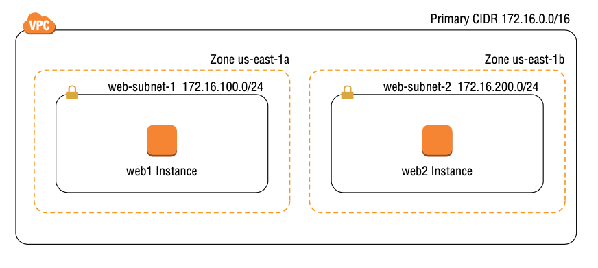
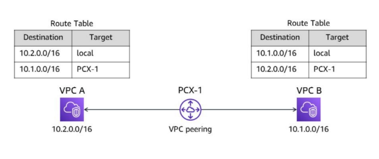
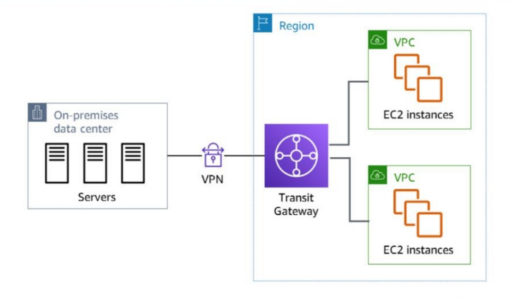
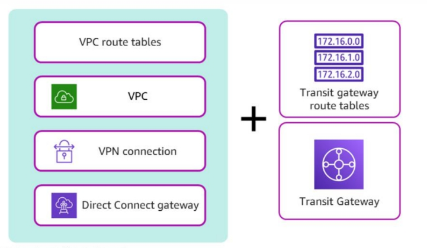

# Amazon Virtual Private Cloud

- A VPC is a virtual network that can contain EC2 instances as well as network resources for other AWS services
- A VPC can exist only within an AWS region, and you can have multiple VPCs in your account (and per region)
- VPCs are scalable allowing you to expand and extend your network without having to add physical hardware — traditional network components (such as routers, switches, VLANs) don’t exist in VPCs, but are abstracted into software functions and called by different names.

## VPC CIDR Blocks

-  A VPC consists of at least one range of contiguous IP addresses — i.e. a *Classless Inter-Domain Routing* (CIDR) block
- The CIDR block determines which IP addresses may be assigned to instances and other resources within the VPC
- You must assign a primary CIDR block when creating a VPC — this cannot be changed later
- There are different ways to represent a range of IP addresses — CIDR notation is the most popular — for example, the CIDR `172.16.0.0/16` includes all addresses from `172.16.0.0` to `172.16.255.255` — a total of 65,536 addresses!
-  The `/16` portion of the CIDR is the *prefix length*, which refers to the length of the subnet mask, which in the case of a VPC CIDR can range from `/16` to `/28`.
- The smaller the prefix length the **greater the number** of IP addresses that will be available.
- Any IP range can be used for a VPC CIDR but it best to use one of the following RFC1918 ranges to avoid conflicts with public Internet addresses:
	- `10.0.0.0 – 10.255.255.255 (10.0.0.0/8)`
	- `11.172.16.0.0 – 172.31.255.255 (172.16.0.0/12)`
	- `12.192.168.0.0 – 192.168.255.255 (192.168.0.0/16)`

-  IP address cannot overlap, so when connecting to another Network (either another VPC or on-premise network) be sure that the IP address ranges are unique.

### Secondary CIDR Blocks

- Additional secondary CIDR blocks can be configured for a VPC after it has been created
- Secondary CIDR blocks must come from either the same address range as the primary or a publicly routable range — they must not overlap with the primary or other secondary blocks

- For example, if the VPC’s primary CIDR is `172.16.0.0/16`, you may specify a secondary CIDR of `172.17.0.0/16` because it resides in the `172.16.0.0/12` range (`172.16.0.0 – 172.31.255.255`)

### IPv6 CIDR Blocks

- AWS can assign an IPv6 CIDR to your VPC (you must request this), however the IPv6 CIDR range is predetermined by AWS cannot be chosen
- The IPv6 CIDR will be a publicly routable prefix from the global unicast IPv6 address space (as all IPv6 addresses are reachable from the Internet)

## Subnets

- A subnet is a logical container within a VPC that holds VPC resources (such as EC2 instances).
- A subnet lets you isolate resources from each other, control how traffic flows to and from your resources, and organise them by function — for example a database subnet to hold RDS instances, or a web subnet to hold web servers — conceptually subnets are similar to virtual LANs (VLANs) in a traditional network.
- Instances must be launched into a Subnet or a VPC, and cannot be moved — you have to terminate the instance and create a new one (data can be preserved you can use an EBS snapshot to create an AMI, and then use the AMI to create an new instance in the new Subnet or VPC).

### Subnet CIDR Blocks

- From the VPC CIDR block, you carve out a smaller CIDR block for each subnet.
- For example, if your VPC has a CIDR of 172.16.0.0/16, one of your subnets may have a CIDR of `172.16.100.0/24`. This range includes all IP addresses from `172.16.100.0 - 172.16.100.255` (a total of 256 addresses).
- AWS reserves the first four and last IP addresses in every subnet — you can’t assign these addresses to any instances.
  - Assuming a subnet CIDR of 172.16.100.0/24, the following addresses would be reserved:
    - `172.16.100.0`
    - `172.16.100.1` – Implied router
    - `172.16.100.2` – Amazon-provided DNS server
    - `172.16.100.3` - Reserved
    - `172.16.100.255`

- The restrictions on prefix lengths for a subnet CIDR are the same as VPC CIDRs — subnet CIDR blocks in a single VPC can’t overlap with each other, and once you assign an IP prefix to a subnet, you can’t change it
- A subnet can’t have multiple CIDRs.
- If a VPC has a primary CIDR and a secondary CIDR, your subnet’s CIDR can be derived from either.

### Availability Zones

- A subnet can exist within only one *availability zone*.
- You can achieve resiliency for your applications by creating two subnets each in a different availability zone and then spreading your instances across those zones. 
- Having subnets in different availability zones is not a requirement, however if your subnets are in the same zone and that zone fails, all instances in those subnets will fail as well.

### IPv6 CIDR Blocks

- If you’ve allocated an IPv6 CIDR to your VPC, you can assign IPv6 CIDRs to subnets within that VPC. 

- The prefix length for an IPv6 subnet is fixed at /64.

## Elastic Network Interface

- An *elastic network interface* (ENI) allows an instance to communicate with other network resources, including AWS services, other instances, on-premises servers, and the Internet — an ENI can be associated to an EC2 instance, or an ELB for example
- An ENI will perform the same basic function as a network interface on a physical server
- Every ENI instance must have a *primary network interface* (also known as the *primary ENI*) which is connected to *only one subnet*

### Primary and Secondary Private IP Addresses

- Each ENI instance must have a *primary private IP address* from the range specified by the subnet which is bound to the primary ENI of the instance — you cannot change or remove this address.
- Additional secondary addresses can be assigned (or removed) but they must come from the same subnet that the ENI is attached to.
- Multiple ENIs can be attached to the same instance (such as a EC2 instance) and the ENIs can be in a different subnet, but they must be in the same availability zone as the instance.

### Attaching Elastic Network Interfaces

- An ENI can exist independently of an instance - an ENI can be created first and then attached to an instance later (so long as they are in the same subnet).
- It is also possible to take an existing ENI that’s not attached to an instance and attach it to an existing instance as a secondary ENI. This lets you redirect traffic from a failed instance to a working instance.

### Enhanced Networking

- Enhanced networking offers higher network throughput speeds and lower latency than ENIs.
- Enhanced networking uses single-root input/output virtualisation (SR-IOV). 
- SR-IOV allows multiple instances on the same physical host to bypass the hypervisor, resulting  in lower CPU utilisation and better network performance.
- AWS supports the following SR-IOV setups:
  - **Elastic Network Adapter** - supports speeds of up to 100Gbps. Most instance types support this.
  - **Intel 82599 Virtual Function Interface** - supports speeds of up to10Gbps. Only supported by the few instance types that do not support ENAs.

## Internet Gateways

- An *Internet gateway* gives instances the ability to receive a public IP address, connect to the Internet, and receive requests from the Internet
- The default VPC has an Internet gateway associated with it by default, however custom VPCs do not have an Internet gateway associated with it by default
- Only one Internet gateway can be associated with a VPC — but you may create multiple Internet gateways and associate with different VPCs

- An Internet gateway is similar to an Internet router, however you must create a you must create a *default route* in a *route table* that points to the Internet gateway in order to allow your instances access to the Internet

## Route Tables

- To control how traffic ingresses, egresses, and moves within your VPC, you need to use routes stored in route tables
- IP routing as a software function that AWS calls an *implied router*, which means there isn't a router to configure, you just need configure routes within a routing table
- A route table is connected to multiple subnets — similar to how a traditional would be
- When you create a VPC, AWS automatically creates a default route table called the *main route table* and associates it with every subnet in that VPC. You can create custom route tables and manually assign it to a subnet if required.
- A subnet cannot exist without a route table association — if you do not explicitly associate a subnet with a custom route table, AWS will use the main, default route table.

### Routes

- Routes determine how to forward traffic to or from resources within the subnets associated with the route table
- IP routing is destination-based — routing decisions are based on the destination IP prefix, not the source IP address
- A route must have the following elements (example route table below):
  - Destination IP prefix (an IPv4 or IPv6 prefix in CIDR notation)
  - Target resource (an AWS network resource such as an Internet gateway or an ENI it cannot be an IP prefix)
- Every route table contains a *local route* that allows instances in different subnets to communicate with each other. The local route is the only mandatory route that exists in every route table — it allows communication between instances within the same VPC

| Destination     | Target                   |
| --------------- | ------------------------ |
| `172.31.0.0/16` | `Local`                  |

### The Default Route

- To enable Internet access for your instances, you must create a default route pointing to the Internet gateway
- The default route is what allows Internet traffic to ingress and egress the subnet (example route table below)

| Destination     | Target                   |
| --------------- | ------------------------ |
| `172.31.0.0/16` | `Local`                  |
| `0.0.0.0/0`     | `igw-0f548521a456ddc356` |

- The `0.0.0.0/0` prefix encompasses all IP addresses, including those of hosts on the Internet — hence why it is listed as the destination in a default route.
- Any subnet that is associated with a route table that contains a route pointing to an Internet gateway is called a *public subnet*. A *private subnet* will not have a route with an Internet gateway as a target.
- If IP Address prefixes overlap, then the router will route based on the closest match, hence why the ordering of the Route table doesn't matter. 

## Security Groups

- A *security group* functions as a stateful firewall that controls traffic to and from an instance by permitting traffic to ingress or egress that instance’s ENI
- Every ENI must have at least one security group associated with it
- One ENI can have multiple security groups attached, and the same security group can be attached to multiple ENIs
- AS security group must be associated to a VPC, can be used by instances that reside in different subnets (within the same VPC)
- A security group contains inbound and outbound rules that are used to specify which traffic is allowed — if you don't explicitly allow traffic using a rule, the security group will block it.
- The order of rules in a security group doesn’t matter
- Each VPC contains a default security group that you can’t delete — it doesn't have to be used and you can modify the rules within it.

### Inbound Rules

- Inbound rules specify what traffic is allowed into the attached ENI, and consists of three required elements:
  - Source (any CIDR or AWS Resource ID of a security group)
  - Protocol
  - Port range

- By default new security groups do not contain any inbound rules, and thus by default reject all incoming requests — this is known as *whitelisting*.
- An example Security Group (inbound rules) is shown below

| Source           | Protocol | Port Range | Description                                |
| ---------------- | -------- | ---------- | ------------------------------------------ |
| 198.51.100.10/32 | TCP      | 22         | Only IP 198.51.100.10 permitted on port 22 |
| 0.0.0.0/0        | TCP      | 443        | All internet (and VPC) traffic on port 443 |

### Outbound Rules

- Outbound rules specify what traffic the instance may send out of the attached ENI, and consists of three required elements:
  - Destination (any CIDR)
  - Protocol
  - Port Range
- By default new security groups will allow all outbound traffic — generally, outbound rules are less restrictive that the inbound rules

| Source    | Protocol | Port Range | Description                                                  |
| --------- | -------- | ---------- | ------------------------------------------------------------ |
| 0.0.0.0/0 | All      | All        | All traffic can leave the security group on all Protocols and Ports |

### Sources and Destinations

- The source or destination in a rule can be any CIDR, and the source can also be the resource ID of a security group
- If you specify a security group as the source, the rule will permit the traffic to any instance with that security group attached — this allows instances to communicate with each other but assigning the same security group to each instance.
- The source security group can also exist in a different AWS account (Account ID will need to be specified)

### Stateful Firewall

- A security group is a stateful firewall, meaning that when a security group allows traffic to pass in one direction, it intelligently allows reply traffic in the opposite direction — this is particularly useful for Ephemeral ports.
- Security group achieve this by using connecting tracking to determine whether to allow response traffic to pass — this works by looking at the flow information for each packet that is allowed by a security group rule. Flow information includes:
  - Protocol
  - Source and destination IP address 
  - Source and destination port number

## Network Access Control Lists

- A *network access control list* (NACL) functions as a firewall in that it contains inbound and outbound rules to allow traffic based on a source or destination CIDR, protocol, and port. Each VPC has a default NACL that cannot be deleted
- A NACL is attached to a subnet, and controls what traffic may enter and exit that subnet. NACLs can’t be used to control traffic between instances in the same subnet — a security group would need to be used
- A subnet can only have one NACL associated with it, and by default the VPC's default NACL is used if a NACL is not specified when creating a subnet
- A NACL can be associated to multiple subnets, provided those subnets are all in the same VPC as the NACL
- A NACL is stateless, meaning that it doesn’t use connection tracking and doesn’t automatically allow reply traffic — you'll often need to explicitly open Ephemeral ports for example.
- By default a NACL is configured to block all inbound and outbound traffic

### Inbound Rules

- Inbound rules determine what traffic is allowed to ingress the subnet. 
- Each rule contains the following elements:
  - Rule number
  - Protocol
  - Port range
  - Source CIDR 
  - Action (Allow or Deny)

* NACL rules are processed in ascending order of the rule number — the lower the number the earlier it is processed
* The last rule in a NCAL is the default rule, and it's designated by an asterisk (*) — it is always the last rule in the list to be executed. The default rule cannot be disabled, modified or deleted, and it is causes all traffic to be defined (unless one of the other previous rules allows it).

| Rule Number | Protocol | Port Range | Source    | Action |
| ----------- | -------- | ---------- | --------- | ------ |
| 90          | TCP      | 80         | 0.0.0.0/0 | Deny   |
| 100         | TCP      | 443        | 0.0.0.0/0 | Allow  |
| *           | All      | All        | 0.0.0.0/0 | Deny   |

### Outbound Rules

- The outbound NACL rules follow an almost identical format as the inbound rules. 
- Each rule contains the following elements:
  - Rule number
  - Protocol
  - Port range
  - Destination
  - Action (Allow or Deny)

- Because an NACL is stateless, it won’t allow return traffic unless you add a rule to permit it. Therefore, if you permit HTTPS traffic with an inbound rule, you must also explicitly permit the return traffic using an outbound rule
- If you do need to restrict access from the subnet — to block Internet access, for example — you will have to create an outbound rule to allow return traffic over *ephemeral ports* (49152 – 65535).
- AWS recommends that in order to maintain compatibility, you should not restrict outbound traffic using an NACL. Instead, use a security group to restrict outbound traffic.

| Rule Number | Protocol | Port Range | Source    | Action |
| ----------- | -------- | ---------- | --------- | ------ |
| 100         | All      | All        | 0.0.0.0/0 | Allow  |
| *           | All      | All        | 0.0.0.0/0 | Deny   |

### Using Network Access Control Lists and Security Groups Together

- Given that a NACL is applied to the subnet, the rules of the NACL apply to all traffic ingressing and egressing the subnet, regardless of how (or if) the security groups are configured.
- When you make a change to an NACL or security group rule, that change takes effect immediately — thus avoid changing security groups and NACLs simultaneously as you might not know which one has caused an issue.
- Extra care should be taken when making changes to instances that have live connections to them, as an incorrectly ordered NACL rule or missing security group rule can terminate those connections.

## Public IP Addresses

- A public IP address is reachable over the public Internet, which is in contrast to private IP addresses (e.g. 192.168.1.1) which can only be routed within a private network
- A public IP address will be required if you want others to directly connect to it via the Internet, which intern will require an Internet Gateway connected to the VPC the instance resides in
- You *may* also give an instance a public IP address if you want it to have outbound-only Internet access
- Public IP addresses are not required when communicating within the same VPC (regardless of whether or not they are in the same subnet).
- When launching an instance into a subnet, you can choose to automatically assign it a public IP, however the down sides are:
  - Public IPs cannot be assigned after the instance has been created
  - Public IPs will not be persisted between reboots of the instance (AWS may terminate an instance for maintenance purposes)

## Elastic IP Addresses

- An elastic IP (EIP) address is a type of public IP address that AWS allocates to your account when you request it
- After AWS allocates an EIP to your account, you have exclusive use of that address until you manually release it
- Outside of AWS, there’s no noticeable difference between an EIP and an automatically assigned public IP
- Once an EIP has been allocated, you must associate it with an ENI — the EIP can be point to any ENI (and can moved at time) whilst keeping the original IP address until you destroy to EIP
- Associating an EIP to an ENI that already has an automatically assigned public IP address allocated will cause the EIP to replace the public IP address 
- An EIP is tied to an AWS region and can’t be moved outside of that region
- It is possible to bring your own IP address (BYOIP) by transferring any public IP addresses that you own into your AWS account as EIPs. You can bring up to five address blocks per region

## AWS Global Accelerator

- Having separate EIPs for each region can be cumbersome to manage (EIPs are always tied to a single region)
- AWS Global Accelerator solves this problem by giving you two anycast static IPv4 addresses that you can use to route traffic to resources in any region
- Global Accelerator static addresses are spread across different AWS points-of-presence (POPs) in over 30 countries. These static addresses are also called anycast addresses because they are simultaneously advertised from multiple POPs
- Users connecting to a static address are automatically routed to the nearest POP, which is the proxied to the resources you have specified in an endpoint group — an endpoint group can contain elastic IP addresses, elastic load balancers, or EC2 instances
- Global Accelerator routes traffic to the fastest endpoint — if the POP that the user is routed to, is unavailable (due to an infrastructure issue for example), then users are automatically, and transparently routed to another POP.

## Network Address Translation

- Network Address Translation (NAT) is a mechanism to map one (or more) private IP Addresses to a single public IP address before transmitting the request out to the internet. 
- The purpose of a NAT device is to allow an instance to access the Internet while preventing hosts on the Internet from reaching the instance directly.

- AWS also supports two resources that can perform NAT:
  - NAT Gateway
  - NAT Instance

### NAT Gateway

- A NAT gateway is a NAT device managed by AWS - it scales to accommodate your bandwidth requirements
- A NAT gateway must be assigned an EIP, and can only reside in only one subnet. It is possible to deployment NAT gateways in multiple subnets across AZs for redundancy.
- After creating a NAT gateway, you must create a default route to direct Internet-bound traffic from your instances to the NAT gateway

- Because a NAT gateway doesn’t use an ENI, you can’t apply a security group to it. You can, however, apply an NACL to the subnet that it resides in.

### NAT Instance

- A NAT instance is a normal EC2 instance that uses a pre-configured Linux-based AMI, however there are some differences to a NAT Gateway:
  - A NAT instance doesn’t automatically scale to accommodate increased bandwidth requirements (if its not correct, you need to manually upgrade to a larger instance)
  - It is not possible to have multiple NAT Instances (e.g. using a auto scaling group)
  - NAT Instances have an ENI, so you must apply a security group to it.
  - You also must remember to assign it a public IP address.

- One advantage of a NAT instance is that you can use it as a bastion host to connect to instances that don’t have a public IP. 
- AWS recommends that you do not use NAT Instances, and should use NAT Gateways instead

## VPC Peering

- You can configure VPC peering to allow instances in one VPC to communicate with VPCs in another over the private AWS network. You may also want to connect your instances to another AWS customer’s instances.
- To enable VPC peering, you must set up a VPC *peering connection* between two VPCs. A VPC peering connection is a point-to-point connection between *two and only two VPCs - you cannot daisy-chain VPC peering connections together and route through them*.
- To use a peering connection, you must create new routes in both VPCs to allow traffic to travel in both directions. For each route, the destination prefix should exist within the destination VPC.
-  A VPC peering connection cannot have overlapping CIDR blocks in either the source or destination CIDR blocks

There are a number of limitations to using VPC peering:

- There is a limit on the number of active and pending VPC peering connections that you can have per VPC
- You can have only one VPC peering connection between the same two VPCs
- The maximum transmission unit (MTU) across a VPC peering connection is 1,500 bytes

## Hybrid Cloud Networking

- In many cases, you will want your AWS resources to essentially be an extension of your data centre, and to remain
  private and inaccessible from the Internet. 
- AWS offers three options for private connectivity between your on-premises network and your VPCs:
  - Virtual private networks (VPNs)
  - AWS Transit Gateway
  - AWS Direct Connect

### Virtual Private Networks (VPN)

-  A virtual private network (VPN), allows you to connect a VPC to an on-premises network such as a data centre or office via a secure connection that goes over the public Internet
- You create a VPN connection by configuring a VPC resource called a virtual private gateway and then configuring your on-premises router or firewall to build an encrypted VPN tunnel with the virtual private gateway
- Virtual private gateways support AES 256-bit and AES 128-bit encryption

- Connecting your on-premises network to multiple VPCs, will require a separate virtual private gateway and VPN tunnel for each VPC - remember that VPC cannot be connected together in a chain
- Connecting multiple VPCs to your on-premises network or connecting many on-premises networks to a VPC should be done via AWS Transit Gateway

### AWS Transit Gateway

- AWS Transit Gateway is a highly available service that lets you connect multiple VPCs and on-premises networks via Direct Connect links or virtual private networks. 
- AWS Transit Gateway also gives you granular control over how traffic is routed among your VPCs and on-premises networks.

#### Transit Gateway Route Table

- The transit gateway route table controls how traffic flows among the attached network resources, and is similar to a VPC route table
- The target of a route in a transit gateway route table can only be an attachment to a VPC, VPN connection, Direct Connect gateway, or other transit gateway - you are unable to specify an ENI or Internet gateway as a target.

### AWS Direct Connect

- The AWS Direct Connect service offers private, low-latency connectivity to your AWS resources
- Direct Connect bypass the Internet altogether, by giving you a dedicated route when accessing AWS resources, which can help by reducing the high latency of a broadband connection. It may also be desirable if you are required to meet regulatory requirements that preclude transferring data over the internet

- There are two types of Direct Connect connections: dedicated and hosted

#### Dedicated

- A dedicated connection is a single physical connection that terminates at an AWS Direct Connect location
- You will need to install your own equipment in a Direct Connect location
- For dedicated connections, you can choose from 1 Gbps or 10 Gbps connections

#### Hosted

- If you need less than 1 Gbps of bandwidth, or if placing your equipment in a Direct Connect location is infeasible, you can get a hosted Direct Connect link that supports speeds between 50 Mbps and 10 Gbps. 
- A hosted connection extends the "last-mile" connection from a Direct Connect location to your data centre or office

#### Virtual Interfaces

- Depending on how you plan to use your Direct Connect link, you must create one or more virtual interfaces. 
- There are three types of virtual interfaces:
  - **Private Virtual Interface** - Allows you to connect to the private IP addresses of resources in a single VPC, such as EC2 and RDS instances
  - **Public Virtual Interface** - Lets you use the public IP address of AWS services that have a public endpoint, such as S3 and DynamoDB
  - **Transit Virtual Interface** - Provides connectivity to one or more AWS transit gateways, often used for when you need to connect resource in multiple VPCs.

## High-Performance Computing

- High-performance computing (HPC) is a computing paradigm that uses multiple instances to simultaneously process computationally intensive workloads in parallel
- HPC clusters fall into one of two categories, which are differentiated by the degree of interaction required between instances

### Loosely Coupled

- Loosely coupled workloads can be broken up into small tasks that each instance can work on independently
- Each unit of work is not dependant upon another, and thus each instance does not need to communicate with instances, alas instances don't need to be in the same cluster placement group
- Examples include image processing or DNA sequencing - each individual work can be 

### Tightly Coupled

- Tightly coupled workloads require massive computing power and can’t be broken up into pieces
- Multiple instances must work together across a low-latency network to form a single supercomputer, hence the instances should be placed in the same cluster placement group
- Tightly coupled workloads include simulations wherein one variable can affect multiple other variables, such as machine learning or weather forecasting

### Elastic Fabric Adaptor

- The elastic fabric adapter (EFA) is a special type of ENA that supports traditional TCP/IP networking capabilities - but it bypasses the operating system's TCP/IP stack resulting in more throughput and reduced latency
- When using an EFA for HPC applications, all instances must be in the same subnet
- Every EFA in a cluster must be attached to the same security group, and that group must allow all traffic to and from the group

### AWS ParallelCluster

- AWS ParallelCluster can automatically manage your Linux-based HPC cluster so that youdon’t have to do it manually. 
- ParallelCluster provisions your cluster instances and creates a 15 GB shared filesystem for them to use. The shared filesystem is stored on an EBS volume that’s attached to a master instance and served up to the other instances via the Network File System (NFS)
- You can also use a shared filesystem such as provided by Amazon Elastic File System (EFS) or Amazon FSx for Lustre

