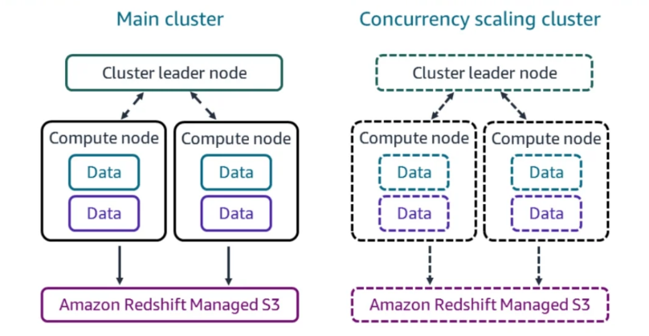

# Database Services

Most applications and services depend on at least one database. A database allows an application to store, organise, and quickly retrieve data.

## Relational Databases

- A **relational database** contains at least one table, in which eacn table contains columns (also known as attributes), and rows (also known as records or tuples).
- Relation databases are designed for data that is in a consistent format, and thus you able to craft queries to obtain parts of the dataset.
- A relational database can be optimized for fast, frequent transactions, or it can be optimized for large, complex queries:
  - **Online Transaction Processing (OLTP)**
    - Designed for use with applications that read and write data frequently, on the order of multiple times per second
    - Optimised for fast queries, and those queries tend to be regular and predictable
    - Often have intense memory requirements so that it can store frequently accessed portions of tables in memory for quick access
    - An OLTP example would be a database for an online ordering system that processes hundreds of orders a minute
  - **Online Analytic Processing (OLAP)**
    - Designed and optimised for complex queries against large data sets, and thus will have large compute and storage requirements
    - For very large datasets, it’s common to aggregate multiple OLTP databases into a single OLAP database
    - Data is often partitioned (or sharded) across multiple nodes, with each node reciving a portion of the database for which it's response for.
    - For example, in an OLTP database for an employee management system, employee data may be spread out across multiple tables. At regular but infrequent intervals, a data warehouse would aggregate these tables into a single table in an OLAP database. This makes it easier to structure SQL queries against the data, and reduces the amount of time it takes to process computationally intensive queries by offloading it to the high-powered OLAP database.

## Non-Relational (NoSQL) Databases

- Nonrelational databases are designed to consistently handle tens of thousands of transactions per second, but are optimised for unstructured data - i.e. data that does not follow a set schema
- NoSQL databases consist of collections (also know as tables), to which items are stored within a collection. Each item has at least on attribute. An attribute (also known as key/value pairs) consists of a unique name called a key, a data type, and a value.
- NoSQL databases usually allow for data to be partitioned acorss multiple nodes, allowing for retrieve of data to be sometime faster.
- NoSQL databases are optimized for queries based on the primary key, any query that is performed against attributes will be slow slower, making nonrelational databases inappropriate for complex or arbitrary queries.
- NoSQL databases generally fall into one of the following categories: 
  - **key/value stores** - data is stored in a simple key/value pair, with each key being unique, and each value representing a form of data type, e.g. string, number, lists, maps etc
  - **document-oriented** - analyzes the contents of a document stored as a value and extracts metadata from it.
  - **graph databases** - analyzes relationships between attributes in different items, and thus discovers relationships in unstructured data

## Amazon Relational Database Service (RDS)

- Amazon Relational Database Service (RDS) is a managed database service that lets you run relational database systems in the cloud.

- To deploy a database using RDS, you start by configuring a database instance, which is an isolated database environment. A database instance exists in a virtual private cloud (VPC) that you specify
- AWS fully manages database instances cannot be accessed via an SSH session, nor do they appear in your EC2 lists

### Database Engines

- RDS offers six database engines to choose from:
  - **MySQL** - designed for OLTP applications such as blogs and e-commerce. RDS offers the latest MySQL Community Edition versions, along with two storage engines - MyISAM and InnoDB - but only the latter is compatible with RDS-managed backups
  - **MariaDB** - a drop-in, open source, binary replacement for MySQL that supports the XtraDB and InnoDB storage engines - but only the latter is compatible with RDS-managed backups
  - **PostgreSQL** - advertises itself as the most Oracle-compatible open source, and thus is a good choice for when you want to run an Oracle compatible database without an Oracle license
  - **Amazon Aurora** - Amazon’s drop-in binary replacement for MySQL and PostgreSQL that offers better write performance than both by using a virtualsed storage layer that reduces the number of writes to the underlying storage. Aurora is designed to let you seamlessly migrate from an existing deployment that uses either of those two open source
    databases.
  - **Oracle** - one of the most widely deployed relational database management systems. RDS provides Oracle Standard Edition One (SE1), Oracle Standard Edition Two (SE2), Oracle Standard Edition (SE) and Oracle Enterprise Edition (EE) as available Oracle database editions.
  - **Microsoft SQL Server** - RDS offers multiple Microsoft SQL Server versions ranging from 2012 to the present, and you can choose you can choose Express, Web, Standard, or Enterprise. The variety of flavors makes it possible to migrate an existing SQL Server database into a managed RDS instance.

### Licensing

- RDS provides two models for licensing the database engine software you run. 
- The ***license included*** model covers the cost of the license in the pricing for an RDS instance, which include:
  - MariaDB and MySQL use the GNU General Public License (GPL) v2.0
  - PostgreSQL uses the PostgreSQL license
  - Microsoft SQL server
  - Oracle Standard Edition One (SE1) 
  - Oracle Standard Edition Two (SE2)

- The ***bring your own license*** (BYOL) model requires you to obtain a license for the database engine you run, which include:
  - Oracle Standard Edition One (SE1)
  - Oracle Standard Edition Two (SE2)
  - Oracle Standard Edition (SE)
  - Oracle Enterprise Edition (EE)

### Database Option Groups

- Different database engines offer various features or options to help you manage your databases and improve security. 
- Option groups let you specify these features and apply them to one or more instances - options do require more memory, thus only enable the options your require
- The options available for a database option group depend on the engine, examples include:
  - Oracle offers Amazon S3 integration
  - Microsoft SQL Server and Oracle offer transparent data encryption (TDE) which ensures data is encrypted before writing it to storage
  - MySQL and MariaDB offer an audit plug-in aloowing you to dedcue which queries have been run

### Database Instance Classes

- When launching a database instance, you must decide how much processing power, memory, network bandwidth, and disk throughput it needs. If your needs change, you can switch your instance to a different class
- RDS divides database instance classes into the following three types

#### Standard

- Standard instance classes meet the needs of most databases
- Standard instance class types are EBS optimized, meaning they provide dedicated bandwidth for transfers to
  and from EBS storage
- Standard instance class provides up to:
  - 384 GB of memory
  - 96 vCPU
  - 25 Gbps network bandwidth
  - 19,000 Mbps (2,375 MBps) disk throughput

#### Memory Optimised

- Memory-optimised instance classes are for databases that have hefty performance requirements, allowing for more data to be stored in memory, and thus resulting in faster query times
- Memory-optimized instance class types are EBS optimized, meaning they provide dedicated bandwidth for transfers to
  and from EBS storage
- There are three latest-generation instance classes, db.x1e , db.z1d , and db.r5, with the most powerful of these (db.x1e) able to provides:
  - 3,904 GB of memory
  - 128 vCPU
  - 25 Gbps network bandwidth
  - 14,000 Mbps (1,750 MBps) disk throughput

#### Burstable Performance

- Burstable performance instances are for development, test, and other non-production databases.
- The latest burstable performance instance class available is db.t3 and it gives you up to:
  - 32 GB of memory
  - 8 vCPU
  - 5 Gbps network bandwidth
  - 2,048 Mbps (256 MBps) disk throughput

### Storage

- AWS measures storage performance in input/output operations per second (IOPS). An input/output (I/O) operation is either a read from or write to storage

- The more IOPS you can achieve, the faster your database can store and retrieve data

- RDS allocates you a number of IOPS depending on the type of storage you select, which in turn will specify the speed in which your database can read/write to the storage volume - it is not possible to exceed the IOPS rating
- The number of IOPS you can achieve depends on the type of storage you select. RDS offers the following three different types of storage

#### General-Purpose SSD

- For most databases, general-purpose SSD (gp2) storage is sufficient - it provides single-digit millisecond latency, as well as being able to support volumes of up to 64 TB
- For each gigabyte of data that you allocate to a volume, RDS allocates that volume a baseline performance of three IOPS, up to a total of 16,000 IOPS per volume, which means that a 20GB volume would recieve 60 IOPS, where as 100GB volume would recieve 300 IOPS (i.e. the larger the volume the the better the performance you'll get)
- The maximum throughput the gp2 storage type offers is 2,000 Mbps (250 MBps) - note your instance must support a disk throughput of this much, as well as allocating a sufficient number of IOPS to sustain this throughput
- Volumes smaller than 1 TB can temporarily burst to 3,000 IOPS, whcih will provide additional IOPS without having to overprovision storage resources
  - Each database instance will recieve 5,400,00 IOPS boost credit, which can be used by your instance when it has IOPS above and beyond its baseline - if you use all your credit up, then you can no longer burst
  - The credit balance is replenished at a rate of one baseline IOPS every second - for example if you have a 200 GB volume with a baseline IOPS of 600, your credit balance increases by 600 IOPS per second, up to the maximum of 5,400,000

#### Provisioned IOPS SSD (io1)

- Provisioned IOPS SSD lets you allocate the number of IOPS you need when you create your instance
- There’s no concept of bursting in io1 storage - the number of IOPS you provision is what you get and what you pay for,
  whether or not you use it
- This makes it useful for databases that require consistent low-latency performance
- If you use a standard or memory-optimized instance class, RDS guarantees that you’ll achieve within 10 percent of the provisioned IOPS for 99.9 percent of the year
- You can provision up to 64,000 IOPS per io1 volume, however the ratio of storage in gigabytes to IOPS must be at least 50:1, for example, if you want 32,000 IOPS you will need to provision at least 640GB of storage

#### Throughput-Optimized HDD (st1)

- Throughput-optimized HDD volumes use magnetic storage, that have sizes that range from 500 MB to 16 TB
- The base throughput depends on the volume size, with 40 MBps of throughput per terabyte, and the maximum throughput topping out at 500MBps for a 16TB volume
- These volume types are appropriate or frequent, sequential reads and writes, such as you might see with data warehousing, extract, transform, and load (ETL), and Elastic MapReduce (EMR) applications.

#### Cold HDD (sc1)

- Cold HDD volumes also use magnetic storage and come in sizes ranging from 500 MB to 16 TB - these drives offer lower throughput
- You get only 12 MBps of throughput per terabyte, with a maximum of 192 MBps for a 16 TB volume.

- These volume types are appropriate or frequent, sequential reads and writes, such as you might see with data warehousing, extract, transform, and load (ETL), and Elastic MapReduce (EMR) applications.

#### Magnetic Storage (Standard)

- RDS offers magnetic storage for backward compatibility with older instances, and is limited to a maximum size of 1 TB and approximatley 100 IOPS.
- AWS is phasing out this storage type and thus is recommended not to use it

### Read Replicas

- Database instances can be scaled up using a vertical or horizontal strategy.
- **Vertical Scaling** 
  - requires you to increase the resources , such as memory, compute, net work speeds or disk throughput, your database instance has without having to reconfigure your application. 
  - You can do this by upgrading the database instance to a larger instance class.

- **Horizontal Scaling** 
  - requires you to create additional *read replicas*, which allows for read-only database queries to be performed against the *read replica*, hence freeing up resources on the *primary instance* to perform writes
  - Data is asynchronously replicated to the read replicas, meaning there is a delay between writing data on the primary instance, and it being available on the read replicas
  - RDS will automatically load balance database connections between the instances, depending upon the type of query that is being performed
  - A read replica and the master may be in different availability zones, and even in different regions
  - You can have up to 5 read replicas for RDS, and up to 15 for Aurora. All database engines support read replicas apart from Microsoft SQL Server.

### High Availability (Multi-AZ)

- A multi-AZ deployment features a primary database ­instance in one availability zone that handles reads and writes to the database, while a standby database instance is setup in a different availability zone
- If the primary instance experiences an outage, it will fail over to the standby instance (usually within two minutes)
- You can configure multi-AZ when you create a database instance or later - all database engines support multi-AZ but implement it slightly differently

#### Multi-AZ with Oracle, PostgreSQL, MariaDB, MySQL, and Microsoft SQL Server

- All instances must reside in the same region (apart from MySQL and MariaDB in which case multiple regions are support)
- RDS synchronously replicates data from the primary to the standby instance - this can introduce some latency issues
- The standby instances are not read replicas, and hence cannot serve traffic.
- When a fail over occurs, RDS changes the DNS record of the endpoint to the standby instance, with no changes to the application.

#### Multi-AZ with Amazon Aurora

- Amazon Aurora supports two options for multi-AZ: single-master and multi-master.
- **Single-Master**
  - An Amazon Aurora single-master cluster consists of a primary instance, and optionally replicas.
  - The primary and replicas all share the same cluster volume, which is synchronously replicated across three availability zones 
  - If the primary instance fails Aurora will promote a replicas to become the primary instance, or it will create a new instance if no read replicas exist
- **Multi-Master**
  - All instances can write to the database, and thus when once instance fail, no fail over occurs, because all instance can continue to write the shared cluster volume that stores the database.
  - Amazon refers to this as continuous availability, rather than high availability - so long as one instance is running, the application is available.

### Backup and Recovery

- With RDS you can take EBS volume snapshots of your database instances. Snapshots include all databases on the instance and are stored in S3
- Taking a snapshot suspends all I/O operations for a few seconds (unless you’re using multi-AZ) - it's advised to take your
  snapshots during off-peak times

- When restoring from a snapshot, RDS restores it to a new instance. The time to restore a snapshot can take several minutes, depending on its size, however the more provisioned IOPS you allocate to your new instance, the faster the recovery time.
- Two metrics should be taken into consideration when considering your backup and recovery needs:
  - **The recovery point objective (RPO)** is the maximum period of acceptable data loss, for example how often should data need to be backed up? (Every 5 minutes, would indicate that you can stand to loose 5 minutes worth of data)
  - **The recovery time objective (RTO)** is the maximum acceptable time to recover data and resume processing after a failure, for example how long can the application be unavailable? 

### Automated Snapshots

- RDS can automatically create snapshots of your instances daily during a 30-minute backup window. You can customise this window or let RDS choose it for you - taking a snapshot impacts performance, so choose a time when your database is least busy
- Enabling automatic backups enables point-in-time recovery, which archives database change logs to S3 every 5 minutes. In the event of a failure, you’ll lose only up to 5 minutes’ worth of data
- Automated snapshots are kept for a limited period of time before they are deleted, you can choose a retention period of between one day and 35 days, with the default being 7 days
- Manual snapshots can also be taken at any time, however these are kept until they are deleted
- Destroying an RDS instance will cause RDS to ask you if you would like to perform a final snapshot before deleting

### Maintenance Items

- AWS routinely performs maintenance items (such as database engine updates, OS patches etc) on your database instances.
- When AWS begins to support a new version of a database engine, you can choose to upgrade to it
- If you want to apply an update that is not backwards compatible, you must apply it manually
- Maintenance tasks can run within a 30-minute weekly maintenance window that you choose, but it cannot overlap with your chosen backup window. Update tasks can sometimes take longer than the 30 minute maintenance window.

## Amazon Redshift

- A data warehouse is a database optimised to analyse relational data coming from transactional systems and line-of-business applications.
- Redshift is Amazon’s managed data warehouse service, uses columnar storage, meaning that it stores the values for a column close together. This improves storage speed and efficiency and makes it faster to query data from individual columns.
- Redshift can be used for:
  - Generating operation analytics on events, such as application logs stored on S3
  - Provide business intelligence, that allows you to run powerful queries across petabytes of semi-structured data
  - Create, train and deploy SageMaker models for machine learning operations
- Redshift supports Open Database Connectivity (ODBC) and Java Database Connectivity (JDBC) database connectors.
- A Redshift cluster contains one or more compute nodes that are divided into two categories.
  - ***Dense compute*** nodes can store up to 326 TB of data on magnetic storage
  - ***Dense storage*** nodes can store up to 8,192 TB of data on SSDs.
- A *leader node* is also attach to clusters with more than one node, which will coordinate communication amount the compute nodes, as well as to communicate with clients

- Rows in a Redshift database are distributed across compute nodes, based upon the distribution style:
  - **EVEN** - the leader node spreads the data out evenly across all compute nodes (default)
  - **KEY** - spreads the data according to the value in a single column (a form of hashing)
  - **ALL** - every table is distributed to every compute node

### Redshift Spectrum

- Redshift Spectrum is a service that allows you to query data from files stored in S3 without having to import the data into your cluster
- You simply define the structure of the data and ,then query it as you wish
- The bucket containing the data you want to query must be in the same region as your cluster

## DynamoDB

- DynamoDB is a managed non-relational database service that can handle thousands of reads and writes per second. It achieves this level of performance by spreading your data across multiple partitions.
- Each table must contain a primary key (also known as a hash key) that contains a single value that is no larger than 2048 bytes. Examples include an email address, a unique username or a UUID.
- When you use only a partition key as a primary key, it’s called a simple primary key.
- A primary key can also be a combination of two values: a partition key and a sort (or range) key. This key type is called a composite primary key. A partition key does not need to be unique, but the combination of the partition key and sort key must be unique.
- DynamoDB distributes your items across partitions based on the primary key.

### Attributes and Items

- At a minimum, every item contains a primary key and corresponding value. When you create an attribute, you must define the data type, which can be one of the following:
  - **Scalar** - can only have one value such as a string, number, binary, Boolean or NULL.
  - **Set** - holds an unordered list of scalar values, holding a minimum of one element
  - **Document** - holds any document structure that may nest other data types

### Throughput Capacity

- DynamoDB can operate in on-demand or provisioned mode.
- In on-demand mode, DynamoDB automatically scales to accommodate your workload - useful for when you don't know what your workload will be
- In provisioned mode, you specify the number of reads and writes per second your application will require. This is called provisioned throughput
- DynamoDB reserves partitions based on the number of read capacity units (RCUs) and write capacity units (WCUs) you
  specify when creating a table
- When reading an item, that read may be strongly consistent (always gives you the most up-to-date data) or eventually consistent (may produce stale data that does not reflect data from a recent write operation). One RCU buys you one strongly consistent read per second, while the same RCU will buy to two eventually consistent reads
- When writing data, one WCU gives you one write per second for an item up to 1 KB in size
- The throughput capacity you specify is an upper limit of what DynamoDB delivers - exceeding that capacity may result in DynamoDB throttling your request

#### Auto Scaling

- Auto Scaling can be configured ti automatically increase your provisioned throughput when it gets close to hitting a defined threshold. This is different to on-demand mode, as you do not need to specify a RCU and a WCU
- To configure Auto Scaling, you specify a minimum and maximum RCU and WCU. You also specify a desired utilisation percentage. DynamoDB will automatically adjust your RCU and WCU to keep your utilisation at this percentage

### Reading Data

- A *scan* lists all items in a table - it is a read-intensive operation and can potentially consume all of your provisioned capacity units
- A *query* returns an item based on the value of the partition key - the value of the partition key you search for must exactly match that of an item. You can also query by the sort key if your table has one
- Secondary indexes let you look up data by an attribute other than the table’s primary key

### Global Tables

- Global tables can be used to replicate a table across multiple regions, thus improving the availability of data

- Your table must be configured in on-demand mode or provisioned mode with Auto Scaling enabled to take advantage of Global tables

- A global table is a collection of replica tables, and a global table can have only one replica table per region

- Whenever you write an item to a replica table, it’s replicated to replica tables in other regions

  Global tables don’t support strongly consistent read across regions

### Backups

- You can back up a table at any time without consuming any RCUs or impacting the performance of DynamoDB
- Backups can be restored to the same region, or a different region

## AWS Data Migration Service

- The AWS Database Migration Service (DMS) can automatically copy an existing database and its schema (if applicable) to another database

- DMS can migrate data between the following:
  - Aurora
  - DynamoDB
  - IBM DB2
  - MariaDB
  - MongoDB
  - MySQL
  - Oracle
  - PostgreSQL
  - Redshift
  - S3
  - SAP

- DMS provisions an EC2 instance called a DMS instance which is able to connect to the target and source databases and perform the replication (and schema conversions if required).

