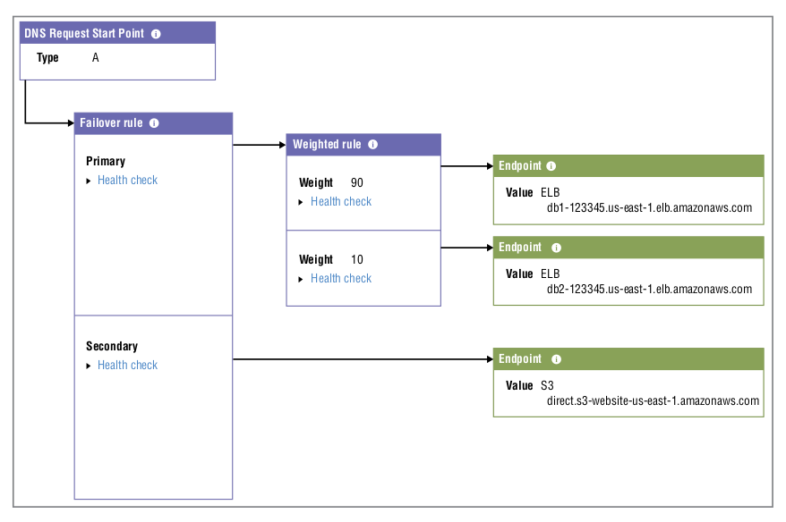

# The Domain Name System and Network Routing

## The Domain Name System

- DNS is responsible for mapping human-readable domain names (like example.com) to one or more machine-readable IP addresses (like 93.184.216.34)
- The Internet naming system is maintained within the *domain name hierarchy* namespace - each namespace can be segment into multiple smaller namespaces
- Associating a domain name like amazon.com with its actual IP address is the job of a *name server* - if a query isn't resolvable locally, it will be forwared onto one of the external DNS name servers specified in your computer’s network interface configuration
- A *domain* is one or more servers, data repositories, or other digital resources identified by a single domain name
-  A *domain name* is a name that has been registered for the domain; that registered name is used to direct network requests to the domain’s resources
- Propagating domain name data among name servers is the job of a *domain name registrar*, such as VeriSign or Amazon Route 53.
- A domain name is made up of multiple parts
  - The rightmost text of every domain address (like .com or .org) indicates the *top-level domain* (TLD)
  - The name to the left of the TLD (the amazon part of amazon.com) is called the *second-level domain* (SLD)
- A *fully qualified domain name* (FQDN) contains the absolute location of the domain including, at the least, a subdomain and the TLD, as well as a trailing dot after the TLD — which represents the domain root, for example `administration.school.edu.`

### Zones and Zones Files

- A *zone* (or hosted zone as Route 53 calls it) defines a DNS domain. 
- A *zone file* is a text file that describes the way resources within the zone should be mapped to DNS addresses within the domain. The file consists of *resource records* that containing the data fields:
  - **Name** - the domain or subdomain name being defined
  - **TTL** - the time to live before the record expires
  - **Record Class** - the namespace for this record (usually IN - Internet)
  - **Record Type** - the record type befined by this record (A, CNAME, MX etc)

- You can obtain resource record details, by using the `dig` command

```shell
$ dig +nocmd +noall +answer amazon.com
amazon.com.		59	IN	A	54.239.28.85
```

### Record Types

- The *record type* you enter in a zone file’s resource record will determine how the record’s data is formatted and how it should be used.
  - **A** — maps a hostname to an IPv4 IP address
  - **CNAME** (Canonical name) — allows you to define one hostname as an alias for another
  - **MX** (Mail exchange) — maps a domain to specified message transfer agents
  - **AAAA** — maps a hostname to an IPv6 IP address
  - **TXT** (Text) — contains human or machine-readable text
  - **PTR Pointer** — points to another location within the domain space (this type will not be processed)
  - **SRV** — A customizable record for service location
  - **SPF** (Sender Policy Framework) — an email validation protocol (no longer widely sup- ported as of RFC 7208)
  - **NAPTR** (Name Authority Pointer) — allows regex-based domain name rewriting
  - **CAA** (Certification Authority Authorization) — establishes authority to issue security certificates for a domain
  - **NS** — Identifies a name server to be used by a zone
  - **SOA** (Start of authority) — Defines a zone’s authoritative meta information

#### Alias Records

- Alias records can be used to route traffic to a resource — such as an elastic load balancer — without specifying its IP address
- Alias records have not been standardised, but are supported by Route 53, allowing you to connect directly with network-facing resources running on AWS


## Amazon Route 53

- AWS Route 53 provides the following services
  - Domain registration
  - DNS management
  - Availability monitoring (health checks)
  - Traffic management (routing policies)

### Domain registration

- Route 53 is a domain registrar allowing you register new domain names
- You can transfer registration of an existing domain from your current registrar to Route 53

### DNS management

- Creating and configuring a hosted zone determines what your users will be shown when they invoke your domain name in a browser, email client, or programmatically
- Route 53 supports importing a preconfigured zone file, or you can setup a hosted zone via the cosole or the AWS CLI
- When creating a hosted zone you need to choose whether this zone will be a public hosted zone or a private hosted zone. Using a privately hosted zone will only allow you access from within the AWS VPC that you specify, for anything public you'll ned to create a publicly hosted zone
- Route 53 will automatically create a start of authority (SOA) record and provide four name server addresses - however, you will need to setup the relationships between your domain and any subdomains

### Availability Monitoring

- Route 53 offers tools to monitor the health of the resources it’s managing
- When creating a new record set, you can choose a routing policy. All routing policies (apart from simple) make it possible to associate your policy with a *health* check
- A health check will regularly test the resource that’s represented by your record set to confirm it’s healthy - you will need to setup a health check
- Route 53 will route traffic to all healthy resources, but once the health check fails, then Route 53 will assume the resource is offline and can be set to redirect traffic to a backup resource

### Routing Policies

- Route 53 routing policies provide a number ways in which you can setup complex routing requirements easily

  - **Simple** - simply maps a domain name to a single static value, such as an IP address
  - **Weighted** - distributes traffic across multiple resources according to a ratio (e.g. 10% of traffic)
  - **Latency** - sends users to resources in the AWS Region that’s closest to them based upon how quick a response will be (e.g. EU users to `eu-west-1` rather than `us-east-1`)
  - **Failover** - routes traffic to a primary resource unless it’s unavailable, in which case traffic will be redirected to a secondary resource
  - **Geolocation** - lets you route users based on their specific continent, country, or state. This allows you to deliver web pages in customer-appropriate languages, restrict content to regions where it’s legally permitted, or generate parallel sales campaigns. Note: if Route 53 fails to identify the origin or the request, then it will route it to a default location (that would need to be configured)
  - **Geoproximity** - routes traffic based upon how close a request is to a particular longitude and latitude value or to an AWS region (it's more fine grained that Geolocation routing)
  - **Multivalue Answer** - evenly distributes traffic across multiple resources, unlike **Weighted** policies that return a single record, a **Multivalue Answer** policy returns all records, sorted in a random order

### Traffic Flow

- Route 53 Traffic Flow is a console-based graphical interface that allows you to visualise complex combinations of routing policies as you build them
- Traffic Flow can make it simple to quickly build a sophisticated routing structure, whilst also allowing you to use and customize routing templates



### Route 53 Resolver

- Route 53 Resolver can manage bidirectional address queries between servers running in your AWS account and on-premises resources
- This can greatly simplify workloads that are meant to seamlessly span private and public platforms


## Amazon CloudFront

- CloudFront maintains a network of physical edge locations placed geographically close to the end users who are likely to request content
- When a request is made, CloudFront assesses the user’s location and calculates which endpoint will be available to deliver the content with the lowest latency
- If this is the first time this content has been requested through the endpoint, the content will be copied from the origin server
- CloudFront distributions support two types of setups depending upon the content that you wish to deliver - web distribution or Real-Time Messaging Protocol (RTMP)

